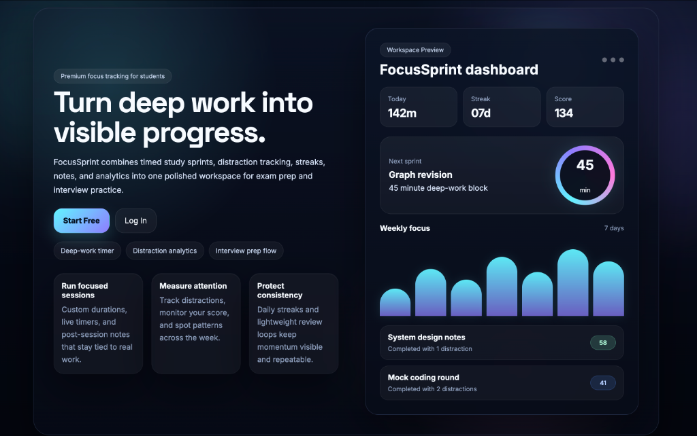
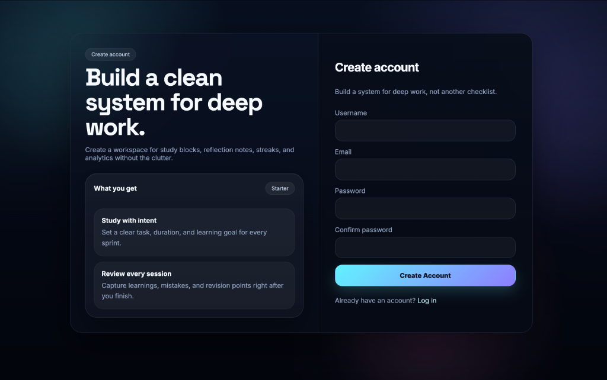
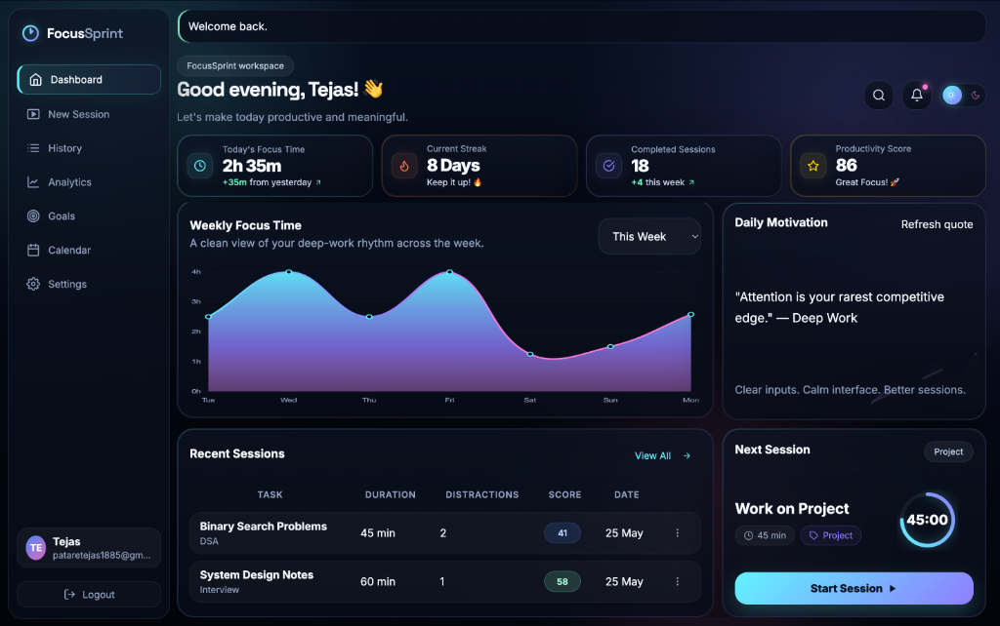
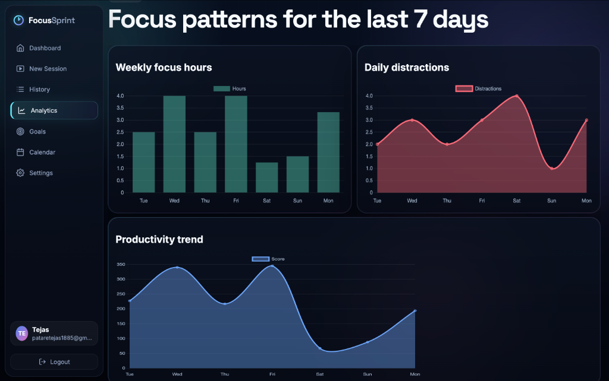

# FocusSprint

A simple, futuristic dark-themed productivity dashboard. Built because my attention span is shorter than a goldfish's and standard calendar apps are too boring. It tracks study blocks, session notes, streaks, and calculates your productivity score.

## Screenshots

Here is what the app actually looks like. It is vibe-coded to absolute visual perfection (glassmorphism cards, purple neon glow greeting, and zero annoying vertical scrollbars on the main dashboard).

### Landing Page


### Register Page


### Dashboard


### Analytics


## Core Features

- **Study Sprints**: Create focused study blocks with custom titles/categories.
- **Timer Widget**: Live circular progress ring with start, pause, resume, and keyboard shortcuts (`S` to Start, `P` to Pause, `D` to Log Distraction). It also plays a nice digital chime when done.
- **Distraction Tracker**: Log how many times you checked your phone to see how bad your attention span is.
- **Post-Session Reflections**: Keep track of what you learned, mistakes you made, and revision points.
- **Auto-Seeding Engine**: When a new user logs in, it automatically seeds 18 mock sessions over 8 days. Why? Because empty charts look incredibly sad and depressing.
- **History & Analytics**: Scrollable table with CSV export and a symmetric 2-column analytics graph.
- **Sidebar Profile**: Nicely truncated email cards so long emails don't break the layout.

## Tech Stack

- **Backend**: Python 3, Flask, SQLite (automatically created as `database.db`, don't worry about setting it up)
- **Frontend**: Vanilla HTML5, CSS (semi-transparent glassmorphism styling), Vanilla JS, and Chart.js for the wave charts.

## How to Run This Locally

1. Setup virtual env and activate it:
   ```bash
   python -m venv .venv
   source .venv/bin/activate  # On macOS/Linux
   # .venv\Scripts\activate   # On Windows
   ```

2. Install dependencies:
   ```bash
   pip install -r requirements.txt
   ```

3. Run the app:
   ```bash
   python app.py
   ```

4. Go to `http://127.0.0.1:5000` and start focusing.

*Note: If you want to seed mock data immediately to see how pretty it looks, just register a new account and it will auto-seed everything.*
